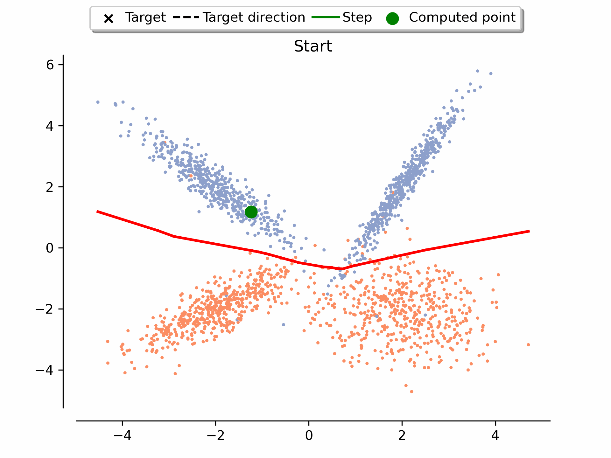
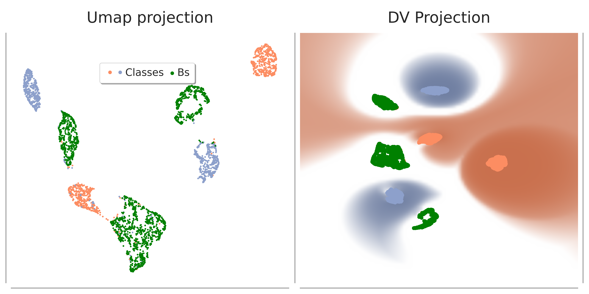

# Guidelines For The Choice Of The Baseline In XAI Attribution Methods
### Authors: Cristian Morasso*, Giorgio Dolci*', Ilaria Boscolo Galazzo*, Sergey M. Plis'', Gloria Menegaz*
*Dept. Engineering for Innovation Medicine, University of Verona.<br>
'Dept. Computer Science, University of Verona.<br>
'' Georgia State University and TReNDS Center.


## Abstract
Given the broad adoption of artificial intelligence, it is essential to provide evidence that AI models are reliable, trustable, and fair.
To this end, the emerging field of eXplainable AI develops techniques to probe such requirements, counterbalancing the hype pushing the pervasiveness of this technology.
Among the many facets of this issue, this paper focuses on baseline attribution methods, aiming at deriving a feature attribution map at the network input relying on a "neutral" stimulus usually called "baseline".
The choice of the baseline is crucial as it determines the explanation of the network behavior. In this framework, this paper has the twofold goal of shedding light on the implications of the choice of the baseline and providing a simple yet effective method for identifying the best baseline for the task. To achieve this, we propose a decision boundary sampling method, since the baseline, by definition, lies on the decision boundary, which naturally becomes the search domain. Experiments are performed on synthetic examples and validated relying on state-of-the-art methods. Despite being limited to the experimental scope, this contribution is relevant as it offers clear guidelines and a simple proxy for baseline selection, reducing ambiguity and enhancing deep models' reliability and trust.
<hr>
IBS algorithm demo



This repo contains the code of IBS algorithm and the source code for the tests performed in the paper.
# Repo
## File structures 
* *deepview*: directory that contains DeepView files
* *splinecam*: directory that contains SplineCam files
* *scripts/few_features.ipynb*: python notebook that contains the code to run experiments on *Custom, Spiral* and *Three* datasets.
* *scripts/few_features_GPU.ipynb*: same as the previous file but this one contains the IBS version that allows to use GPU to run the algorithm.
* *scripts/image_case.ipynb*: python notebook that contains the code to run experiments on *Image* dataset.
* *src/utils_train.py*: python file that contains the code to run training and validation on one or more output neurons. 
* *src/IBS.py*: python file that contains the code for `IBS` and `IBS_gpu`
## Algorithm Usage

The algorithm computes a sample of the inner boundary, to obtain an optimal baseline is suggested to run the algorithm with different starting points in order to compute the entire inner boundary.
It returns a tuple with (`baseline`, `starting point`), the output can change according with params
#### Inner Decision Boundart single sample 
```python
#simple run
baseline, path, fail = IBS(starting_point, model, iter(class_0_data),iter(class_1_data) , precision=0.02, iter = True, ret_fail=True, device = 'cpu', noise_mul = 1/10, path = True)
```
#### Compute inner Decision Boundary
To compute the a big portion or the entire inner DB
```python
#multiple run
import torch 

inner_DB = []
fails = 0
all_data = torch.concatenate([class_0_data, class_1_data])
for starting_point in all_data:
    baseline, _, fail = IBS(starting_point, model, iter(class_0_data),iter(class_1_data) , precision=0.02, iter = True, ret_fail=True, device = 'cpu', noise_mul = 1/10, path = True)
    inner_DB.append(baseline)
    fails += fail
inner_DB = torch.stack(inner_DB)
```


### Parameters
'-' means mandatory 
| **Param** | Default | Meaning |
| -| -| -|
| `bs` | -| Search starting point |
| `model` | -|Neural Network which has to be explained |
| `target_class_0` | -| single point or pool of points (iterator of points), used as reference to identify class 0 by the algrithm. It also represent the limits of the search space ( target_class_0 $\cup$ target_class_1).|
| `target_class_1` | -| single point or pool of points (iterator of points), used as reference to identify class 1 by the algrithm. It also represent the limits of the search space ( target_class_0 $\cup$ target_class_1).|
| `precision` | `0.05` | precision to consider a point a baseline {(.5-precision), (.5+precision)}|
| `iter` | `False` | False if the reference (target_class_0 and target_class_1) represent one point, True if the reference is an iterator |
| `ret_fail` | `False` | Returns a value {0,1} to indicate if the algorithm failed to find a baseline, i.e. it runs out of samples in the pool. Returns (`baseline`, `starting point`, `fail`) |
| `device` | `'cpu'` | device to run the algorithm |
| `noise_mul` | `2` | scalar value to modify the intensity of the step, fixed value |
| `path` | `True` | Returns als0 a list of the points used at each iteration. Returns (`baseline`, `iteration points list`) |
| `sc_func` | `lambda x:x` | scaling function to modify the intensity at each iteration | 

#### Example of scaling function
```python
def scaling_function(x): 
    return (len(all_data)/2-x) / len(all_data)/2
```
This scaling function is based on numbers of samples. It represents a decresing curve and `x` represent the iteration number, it retuns the curve values with `x` as index.

**To be added**: iteration limit

## After the inner DB
### Plotting
Once the inner DB is computed, you can plot it, in two or three dimentions, or also using a projection to represent your data in a two dimentions plot.
#### Result sample

#### Feature reduction
To reduce the dimensionality of the task we use UMAP, as follows
```python
import umap

all_data = np.concatenate([class_0_data,class_1_data])
labels = np.zeros(all_data.shape[0]+bs_arr.shape[0])
labels[class_0_data.shape[0]:] = 1
labels[class_0_data.shape[0]+class_1_data.shape[0]:] = 2 # setting baseline labels as 2 just for the sake of visualization
reducer = umap.UMAP(50,random_state=seed, init="pca")
reducer.fit(np.concatenate([all_data,bs_arr]))
embedding = reducer.transform(np.concatenate([all_data, bs_arr]))
``` 
#### Result sample



### Attributions
If you are interested most in compute the attributions for a given sample we suggest to extract the baseline that lies in the orthogonal projection of the sample to the Decision boundary segment, if available, otherwise your best option is compute the closest baseline to the sample that you want to investigate.

In addition is possible to compute the class attributions, computing the attributions for each data point of a specific class.
